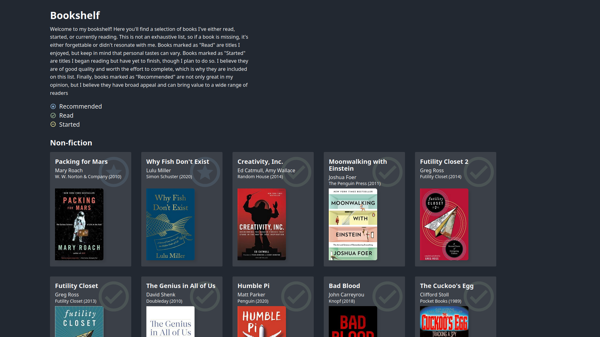

# Bookshelf

 

This is the source code for my personal project where I list and share books I've read, started, and recommend to others. The website features a user-friendly interface where you can browse through various book cards, each containing the book's title, author(s) name, year of first publishing, publisher, and an image of the cover.
Tools and Technologies

## Tools

The website is built using Next.js 13, which is a popular React-based framework known for its performance, ease-of-use, and flexibility. For the content management system (CMS), I chose Contentful, which provides a headless CMS solution that enables me to manage the book data, including metadata and images, in a centralized location.

I chose to use TypeScript and Zod for this project to ensure that my code is type-safe and my API calls are validated against the data schema in my CMS. This combination provides an additional layer of safety and makes it easier to catch issues early on. By using TypeScript and Zod together, I can be confident that my code is robust and reliable, even as I continue to make changes to my content model.

Using these tools, I was able to build a responsive and dynamic website that allows me to easily add new books, update existing ones, and showcase my book collection in an organized and visually appealing way.

## Screenshots

## Credits

books (favicon) by Jakub Čaja from <a href="https://thenounproject.com/browse/icons/term/books/" target="_blank" title="books Icons">Noun Project</a>
